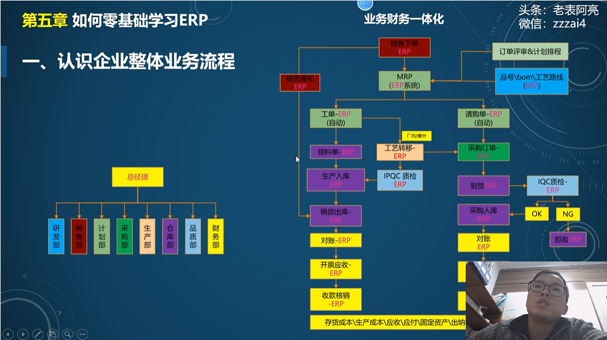

# ERP学习笔记

## 1. ERP基础知识

### 1.1 账套

账套即系统环境，测试或生产

### 1.2 基础数据

全局性基础数据，公司，部门，工厂，人员

局部性基础数据，销售模块（客户，价格），采购模块（供应商，价格），财务（会计科目，辅助核算项）

### 1.3 权限管理

定义账号属于哪个组织，给账号赋予工作角色，某个组织显示哪个定义出来的菜单，赋予账号对应增删改查的功能。

公司组织架构分配-》菜单功能分配-》作业角色（增删改查）-》数据角色（哪个字段可见）

